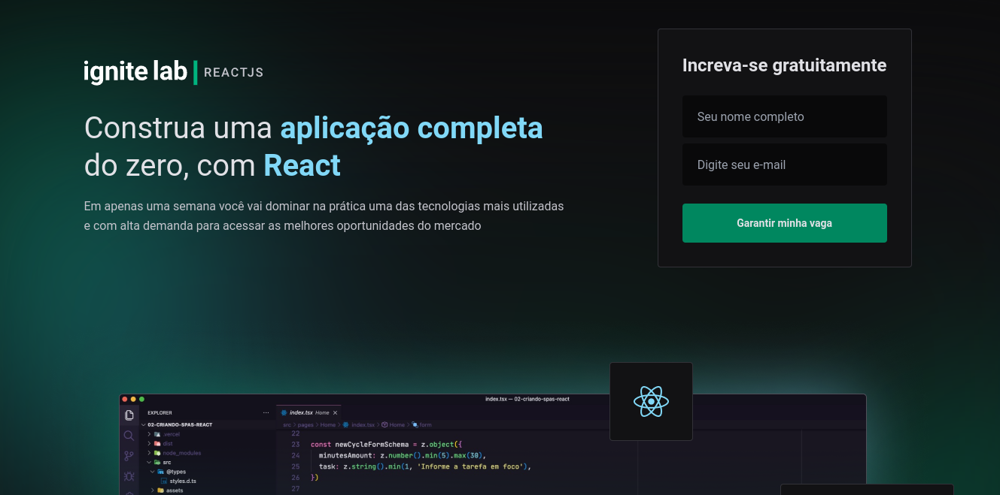

<h1 align="center">Event Platform</h1>

  
   
  

## Tecnologias

Esse projeto foi desenvolvido com as seguintes tecnologias:

- [React](https://reactjs.org)
- [Vite](https://vitejs.dev/guide)
- [TypeScript](https://www.typescriptlang.org)
- [Tailwindcss](https://tailwindcss.com)
- [GraphQL](https://graphql.org)
- [Hygraph](https://hygraph.com/)

## Projeto

Event Platform é uma plataforma de videos para eventos da web

## Sobre o Projeto

 A aplicação consome uma API do Hygraph que contém lições, professores, inscritos e desafios. No frontend feito com React e Tailwindcss, que consome API com GraphQL e com Apollo Client

## Para rodar o projeto:

  - Instale os módulos: `npm install` ou `yarn`
  - No frontend:
    - Rode: `npm run dev` ou `yarn dev`
